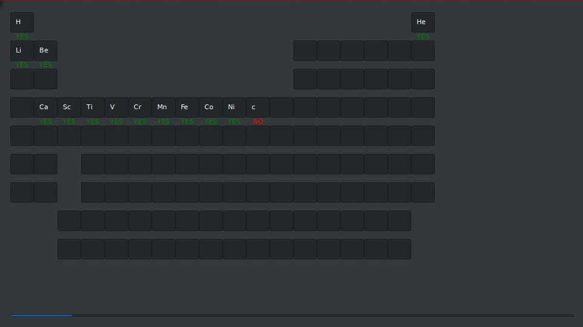

# Periodic table trainer

This is an extremely simple program in order to memorize the periodic
table of elements. It shows what can you do with
very few lines of raku when you're bored.


## Installing

```
zef install .
```

Or just copy the bin script somewhere.
You'll need the simple package `GTK::Simple`.
```
zef install GTK::Simple
```

## Screenshot

Nothing fancy, just some inputs...
A screenshot is here:



